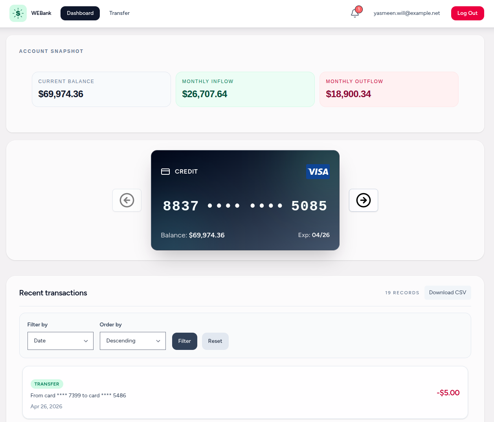
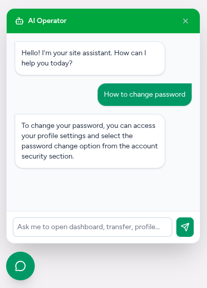

# Web Banking

SPA created with MVC using Laravel, React, and Inertia.



Implemented AI with RAG for FAQ and as a tool for navigation.



## Technologies

- Laravel
- React
- Inertia
- Tailwind
- PostgreSQL

## Getting Started

1. Clone the repository

   ```sh
   gh repo clone VladBlnO0/WEBank-Laravel
   ```

2. Run command

    ```sh
    composer run dev
    ```

3. Configure the `.env` and enter API key
